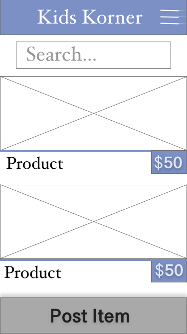
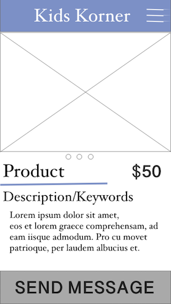
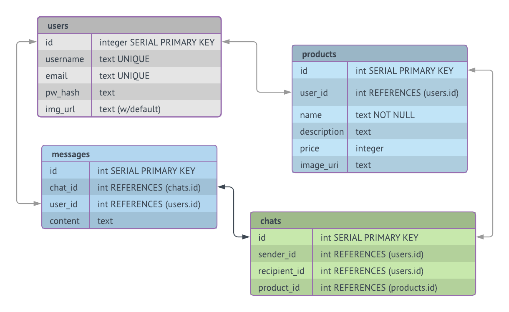

# kidskorner
NOTE: the backend for this app is a rails api server hosted on Heroku.  
The github for those files lives [here](https://github.com/sboozy/kidskorner-api).  

## Overview
Kids are expensive!

Its amazing how such a tiny human requires so much stuff - crib, travel crib, co-sleeper, rock-n-play, baby-swing, baby jumper and the list goes on and on... and on.  What is also amazing, is that kids only need these things for short windows of time. This mobile app is for Moms and Dads who are looking to either sell slightly-used kid stuff to other parents, or buy slightly-used kids stuff from other parents.

A user launches the app and is asked to either Register or Login.  Once they have logged in they immediately see postings from other users and can click on each of those to  see more details. If they are interested in a post they can then message that user directly in the app.  

A user also has the ability to create their own post for selling an item, update that post and delete that post once they have sold that item.  This post includes the ability to upload a photo directly from their phone or camera roll.  

Other things to consider: 
+ Marketplace based on location (zipcode)
+ payment capabilities through the app

## WIREFRAMES
-Scrolling list of all products
  
-Single product posting
   
-Post a product page
  
-Messager capability
  

## Pages/Components
+ Login/Register Page
+ All postings page
    + Nav Bar
	+ Search box
+ View Single Posting(with message capability)
    + Nav Bar
    + 
+ Make a Post (edit Post/Delete Post)
    + Nav Bar    
	+ Clean Form with upload capability
+ Edit/Delete Post
    + Nav Bar
    + Form with info with edit/delete button
+ Message History
    + Nav Bar
+ Single Message    
    + Nav Bar
+ User Profile 
    + Nav Bar
+ Edit User Profile
    + Nav Bar

## TABLES
 

## TECHNOLOGIES
#### Frontend
+ React Native

#### Backend
+ ~~Rails (with ActionCable)~~ 
+ Node.js/Express
+ Postgresql

#### Other
+ Postman (for testing)
+ LucidChart (for table schema)
+ Adobe XD (for wireframes)
+ Heroku (hosting backend API server)
