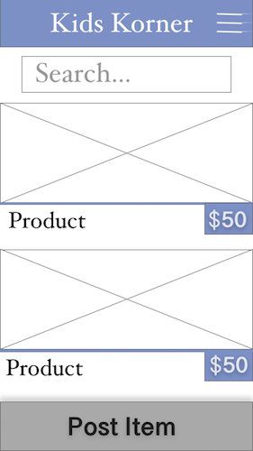
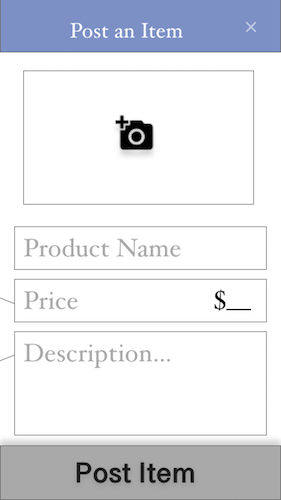
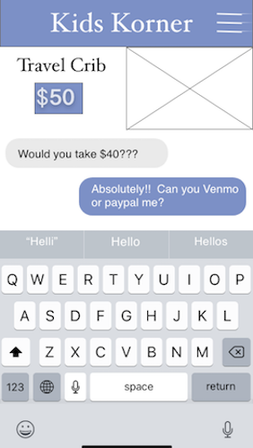

# kidskorner
NOTE: the backend for this app is a rails api server hosted on Heroku.  
The github for those files lives [here](https://github.com/sboozy/kidskorner-api).  

## Overview
Kids are expensive!

Its amazing how such a tiny human requires so much stuff - crib, travel crib, co-sleeper, rock-n-play, baby-swing, baby jumper and the list goes on and on... and on.  What is also amazing, is that kids only need these things for short windows of time. This mobile app is for Moms and Dads who are looking to either sell slightly-used kid stuff to other parents, or buy slightly-used kids stuff from other parents.

A user launches the app and is asked to either Register or Login.  Once they have logged in they immediately see postings from other users and can click on each of those to  see more details. If they are interested in a post they can then message that user directly in the app.  

A user also has the ability to create their own post for selling an item, update that post and delete that post once they have sold that item.  This post includes the ability to upload a photo directly from their phone or camera roll.  

Other things to consider: 
+ Marketplace based on location (zipcode)
+ payment capabilities through the app

## WIREFRAMES
---Scrolling list of all products  
  
----
---Single product posting  
   
----
---Post a product page  
  
----
---Messenger capability  
  
----

## Pages/Components
+ Login/Register Page
+ All postings page
+ View Single Posting(with message capability)
+ Make a Post (edit Post/Delete Post)
+ Edit/Delete Post
    + Form with info with edit/delete button
+ Message History
+ Single Message    
+ User Profile 
+ Edit User Profile

## TABLES
 

## TECHNOLOGIES
#### Frontend
+ React Native
+ React Navigation

#### Backend
+ ~~Rails (with ActionCable)~~ 
+ Node.js/Express
+ Postgresql

#### Other
+ Postman (for testing)
+ LucidChart (for table schema)
+ Adobe XD (for wireframes)
+ Heroku (hosting backend API server)

## TRIALS & TRIBULATIONS  
This project originally started out as a React-Native on Rails project but after 5 days I scraped the Rails part and rebuilt my backend in Express.  This put me a little behind in my research and exploring of React-Native but I was able to use React Navigation to handle the routing of my pages.  Although the backend is setup for Auth, the front end is still a work in progress.  I have temporarily removed my restrict functions so that I could see all products and create a new product.  That being said, it took me several more days to realize that a 'POST' request to my API hosted on heroku needs to be sent with 'headers' not 'header'... (sigh)   I am still very excited to continue working on this mobile app, finishing my CRUD and adding a messaging feature. Please keep checking back for updates!
